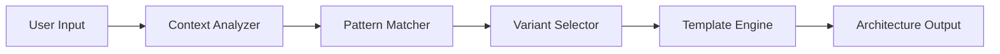

# Architecture Design

## Overview

`arch` is an adaptive architecture advisor that provides template-based architectural patterns and design recommendations for Python projects. It serves as a strategic decision-support tool for software architecture choices.

## Core Components

```
arch/
├── core/                    # Core architecture engine
│   ├── advisor.py          # Main advisor orchestration
│   ├── pattern_matcher.py  # Pattern detection & matching
│   └── context_analyzer.py # Project context analysis
├── patterns/               # Architectural pattern templates
│   ├── microservices.py    # Microservices patterns
│   ├── event_driven.py     # Event-driven architecture
│   ├── layered.py          # Layered/n-tier architecture
│   └── serverless.py       # Serverless/FaaS patterns
├── templates/              # Code/structure templates
│   ├── project_structures/
│   └── config_templates/
└── cli/                    # Command-line interface
    └── commands.py
```

## Design Philosophy

### Template-Based Variants

The system uses **template-based architecture variants** rather than generative AI:

- **Reproducibility**: Same inputs → same architecture recommendations
- **Auditability**: Clear mapping from requirements to pattern selection
- **Speed**: Instant recommendations vs. LLM generation latency
- **Cost**: No API calls for common patterns

### Pattern Selection Algorithm

```
Input: Project requirements, constraints, context
  ↓
Context Analysis (team size, scale, complexity)
  ↓
Pattern Matching (requirement → pattern affinity)
  ↓
Variant Selection (template instantiation)
  ↓
Output: Architecture recommendation + rationale
```

## Key Design Patterns

### 1. Strategy Pattern

**Location**: `core/advisor.py`

Different architectural strategies (microservices, monolith, serverless) are interchangeable at runtime based on project constraints.

```python
class ArchitectureStrategy(ABC):
    @abstractmethod
    def recommend(self, context: ProjectContext) -> ArchitectureRecommendation:
        pass

class MicroservicesStrategy(ArchitectureStrategy):
    def recommend(self, context: ProjectContext) -> ArchitectureRecommendation:
        if context.team_size < 5:
            return ArchitectureRecommendation(
                pattern="monolith_first",
                reason="Team too small for microservices overhead"
            )
        # ... microservices pattern logic
```

### 2. Template Method Pattern

**Location**: `templates/project_structures/`

Base templates define the skeleton, concrete implementations fill in details:

```
template/
├── base/           # Skeleton structures
└── variants/       # Language/framework-specific fills
```

### 3. Repository Pattern

**Location**: `patterns/*.py`

Architectural patterns are stored as versioned templates, queried by metadata:

```python
class PatternRepository:
    def find_by_scale(self, scale: Scale) -> List[Pattern]:
        """Find patterns matching project scale"""
        return [p for p in self.patterns if p.supports_scale(scale)]
```

## Data Flow



## Extension Points

### Adding New Patterns

1. Create pattern class in `patterns/`
2. Implement `ArchitectureStrategy` interface
3. Register in `PatternRepository`
4. Add template variants in `templates/`

### Adding New Templates

1. Create template in `templates/project_structures/`
2. Add metadata YAML describing context affinity
3. Register in template registry

## Trade-offs

| Aspect | Choice | Rationale |
|--------|--------|-----------|
| Pattern Source | Templates vs LLM | Templates for speed/cost; LLM for custom edge cases |
| State | Stateless | No architecture history needed per session |
| Extensibility | Plugin patterns | New patterns via drop-in files |

## Dependencies

- **External**: None (core is pure Python)
- **Optional**: LLM providers for custom recommendations (OpenAI, Anthropic)
- **Dev**: pytest, ruff, mypy

## Future Enhancements

- [ ] Architecture Decision Records (ADR) generation
- [ ] Migration path recommendations (monolith → microservices)
- [ ] Cost modeling for cloud architectures
- [ ] Team skill assessment integration
