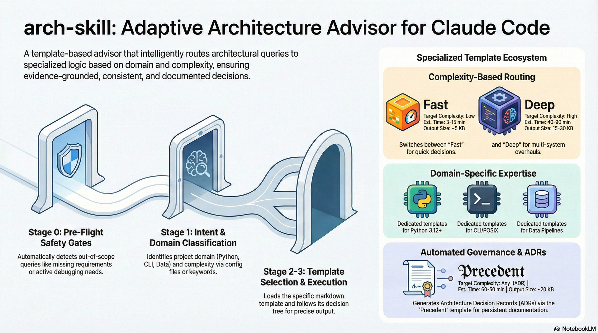

# arch: Adaptive Architecture Advisor

[](https://www.python.org/downloads/)
[](LICENSE)
[](https://claude.ai/code)

Template-based architectural decision making for Claude Code.

## 🎥 Explainer Video

[](assets/videos/arch_explainer_pbs.mp4)

*Click image to watch PBS-structured explainer video (2:15) - Problem → Behavior → Solution*

## 📚 Documentation

| Document | Description |
|----------|-------------|
| [ARCHITECTURE.md](ARCHITECTURE.md) | System architecture, design patterns, and data flow |
| [examples/](examples/) | Usage examples and integration patterns |
| [docs/adr/](docs/adr/) | Architecture Decision Records |
| [CHANGELOG.md](CHANGELOG.md) | Version history and changes |

## Installation

```bash
pip install <package-name>
```

For development:
```bash
git clone https://github.com/user/<package-name>.git
cd <package-name>
pip install -e ".[dev]"
```

## Usage

```python
import <package_name>

# Basic usage example
# Basic usage
```

## 🚀 Usage

```bash
/arch "design data pipeline for real-time analytics"
/arch "template:fast How to add caching?"
```

## 🛠 Installation

### Development (Editable)
```bash
cd P:/packages/arch
pip install -e .
```

### Skill Symlink
```powershell
cmd /c mklink /D "P:\.claude\skills\arch" "P:\packages\arch\skill"
```

## Features

- **Auto-routing**: Selects appropriate template based on domain and complexity
- **Templates**: fast, deep, cli, python, data-pipeline, precedent
- **Configuration**: `.archconfig.json` (project) → `~/.archconfig.json` (user) → `ARCH_DEFAULT_DOMAIN` (env)
- **Out-of-scope detection**: Catches missing requirements, unknown codebase, debug/diagnosis focus

## Configuration

Create `.archconfig.json`:
```json
{
  "default_domain": "fast",
  "templates_dir": ".claude/skills/arch/resources"
}
```

## Related Tools

**[archlint](https://github.com/csf-dev/archlint)** - Architectural linting and validation (separate package)

While `arch` helps you design architectures, `archlint` checks whether your implementation follows architectural rules and principles. Use them together for a complete architecture workflow:

1. **Design Phase** → Use `arch` to explore architectural options
2. **Implementation** → Build your system following the design
3. **CI/CD Phase** → Use `archlint` to validate compliance

## License

See LICENSE file.
